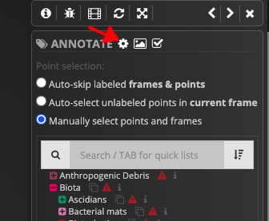
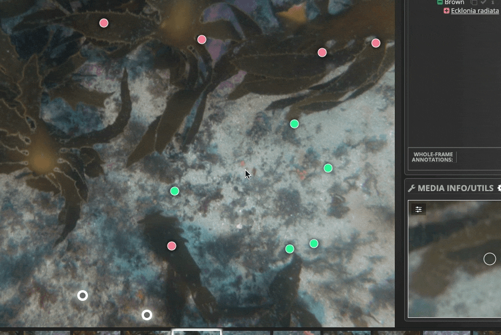
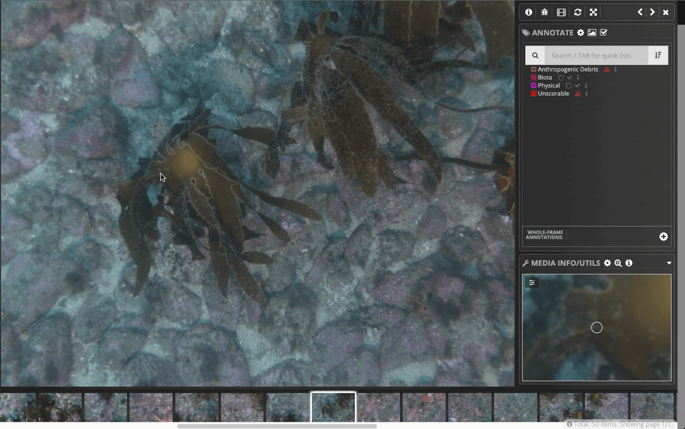
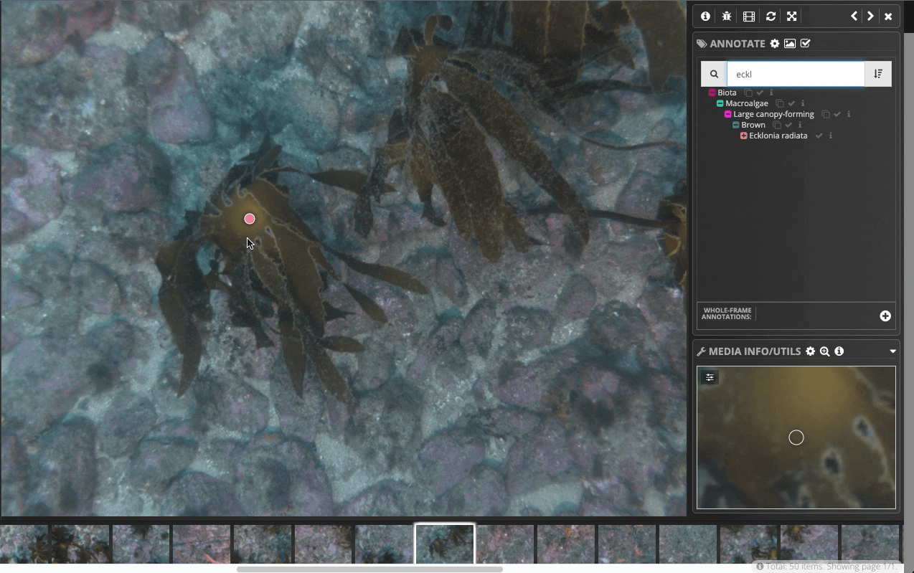

# Annotation on Squidle+

Squidle+ offers flexibility in annotation workflows and different annotation modes eg: whole-frame, points, polygons, 
bounding boxes, multiple labels per annotation with tags & comments and is designed to be media-type agnostic, ie: the 
same annotation framework can be used for images, videos, large scale mosaics, stereo images, transect quadrats, and 
more through the definition of media interpreter plugins. Integrated QA/QC tools, and cross validation between 
annotators enables both human-human and human-algorithm cross-checking and validation.
For definition of the terminology used here, refer to [Useful Terminology](../info/useful_terminology.md). 

This page covers the following:

[TOC]

## Basic annotation workflow
In general, the workflow for annotation can include the following steps.
This page covers **#3** in the list below, and other steps refer to other sections, where relevant. 

1. **Sign up**: 
   you need a user account in order to create or access annotation data

1. **Explore & Set up**: 
   all imported datasets should be accessible through the [Explore](/geodata/explore) interface (see 
   [here](../data_import/ingesting_data_from_cloud_storage.md) for info on importing data). Use the dataset selection 
   tools on the explore page to create a new Media Collection and Annotation Set 
   (see [Media Colletions & Annotation Sets](media_collections_and_annotation_sets.md) and 
   [Managing your datasets](../dataset_management/managing_your_datasets.md))

1. **Annotate**: 
   open the Annotation Set and start annotating using the annotation tools, as described below.
   
1. **Share / collaborate**
   use the dataset sharing and collaboration tools to add data to user groups with granular permissions. You can also 
   release data publicly through the sharing tools. See [Usergroups and sharing](../dataset_management/usergroups_and_sharing.md) for more.
   
1. **Export**:
   use the export tools to export your annotations in a format of your choice. See [Exporting annotations](../data_export/exporting_annotations.md)

## Annotation basics
After defining a Media Collection and Annotation Set, open the Annotation Set and click on a Media Object thumbnail to 
open the annotation modal window.

### Applying labels
Annotation is done by selecting one or more point(s) and then assigning a label. If your Annotation Set includes a 
point layout method, it will automatically generate points for you to label. If you're using an Annotation Set that 
requires manual point creation, you'll need to create points to label. See the [Create new points](#creating-new-points-manually) section, below.

* Select one or more point(s) by 
    * Left-clicking them with your mouse, or
    * Using a bounding box: click somewhere on the frame (not on a point) and drag over the points you want to select, or
    * Using an auto-select method (see [Auto-point selection](#using-an-auto-point-select-method) below), or
    * Using the keyboard: `CTRL+A` to select all unlabeled points 
* Using the mouse, you can position the cursor over points and see a zoomed in section at the bottom right. In the zoom
  window, there are also options to modify the brightness and contrast of the image.
* With one or more point(s) selected, find the desired label in the Annotate Panel on the right: 
    * Browse the Label Scheme, clicking the plus/minus to expand or collapse nodes, or 
    * Use the search box to find labels. Simply start typing to filter labels. Apply search options by clicking on the 
      magnifying glass icon <i class="fa fa-search"></i>. Search by label name (default) and also by: 
        * Mapped names: vocab_elements from supported vocab_registries (eg: WoRMS species names)
        * Common names: from supported vocab_registries (eg: WoRMS vernaculars)
        * Synonyms: names of labels in other Label Schemes that have been linked through semantic translation mappings
* Apply the selected Label by left-clicking with the mouse or, if searching, with your keyboard using `UP` / `DOWN` arrow keys & `ENTER`.
  The `SPACE` key on your keyboard will expand and collapse nodes (similar to clicking the plus/minus icons)
* Once fully annotated, navigate through Media Objects in a Media Collection by:
    * Clicking the arrow buttons <i class="fa fa-chevron-left"></i>  <i class="fa fa-chevron-right"></i> at the top of the annotation window, or
    * Using the `LEFT` and `RIGHT` arrows on your keyboard, or
    * Using an auto-select annotation select method (see [Auto-point selection](#using-an-auto-point-select-method) below)   
    

Some tips:

* When selecting points, the focus is automatically assigned to the search box, so you can just start typing to 
  search.
* Using your keyboard to search and apply labels after selecting points is usually quicker than clicking them with 
  the mouse.
* To reload / refresh annotations and resizes the frame (if necessary), click the <i class="fa fa-refresh"></i> icon, or 
  use the keyboard shortcut: `CTRL+R`. This can be useful for collaborative labelling or if you resize the annotation window.

### Using an auto-point select method
The auto-point select methods allow you just focus on labelling using your keyboard without needing to use your mouse.
It will automatically select points for you and focus the zoom window. Once a label has been applied, it will move to 
the next unlabeled point.

* Click the <i aria-hidden="true" title="cog" class="fa fa-cog"></i> icon at the top of the Label Scheme panel to expand 
  the annotation options. Click one of the auto point select options:
    * **Auto-skip labeled frames & points**: will advance to next unlablled point in Media Collection, auto advancing the media objects.
    * **Auto-select unlabeled points in current frame**: will select the next unlablled point in the current frame
    * **Manually select points and frames**: will not auto-advance, and allow for manual point selection
  

### Adding tags and comments
* Right-click an annotated point
* Select / search tags to apply (optional)
* Type a freeform text comment (optional)
* Click "SAVE" for each annotation that you have edited 

### Creating new points (manually)
Depending on what type of point layout method you have chosen for your Annotation Set, you may not want to do this,
since your points may be auto-generated. To create points, you need an Annotation Set that allows manual point creation.
See [Media Collections and Annotation Sets](media_collections_and_annotation_sets.md).

* To add a new point, double-click somewhere on the frame (this will only work if the Annotation Set allows it).
* Label as described in the [Applying labels](#applying-labels) section, above.

### Full frame annotations
...

### Creating Bounding boxes & Polygons

* To create a bounding box, click on a point and drag your cursor

Polygons:

* To draw a polygon around a point, right-click a point to bring up more options and click the "Polygon" button
* Click on the frame to add vertices to your polygon
* Double-click to finnish drawing

To delete a bounding box or polygon, draw a small bounding box. Below a minimum size, the bounding box goes red and is 
deleted. 

### Moving annotations
...

### Multiple labels per annotation
...
