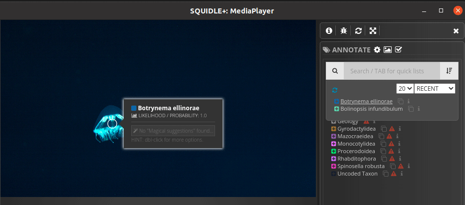

# Annotation flow

## Deep-learning training dataset for general object detection
In this mission, we will make bounding box annotation for the Arctic mid-water biota.
The abstract for the mission is depicted as below. 

### Tasks

- Give a tag for the first frame the individual appeared 
- Giving bounding boxes as much as possible for the individual but make sure there are the differences from the frame previously captured 
- Link all images tagged on the same individual
- Give a tag for the last frame the individual appears
  
## 1. Capture a first image as "Enter Frame"

1. Watch through a video file until you find an organism.
1. If you find an organism, first you need to do is giving a "Enter Frame" tag to the first capture image that the individual appeared first time.
    1. Capture the image by clicking **Camera mark** on **SquidvidPro**.
    
    1. Now the frame captured and the frame grab sent to **Squidle+**. As you can see same images are loaded for both windows.
    
    1. Click somewhere on **Squidle+** window and now you can annotate.
    1. Click **A** key on your keyboard or click **ANNOTATE** button. 
    
    1. Now you can see annotation window.
    1. Double click using cursor the position where you can see the individual. Then you can see annotation point.
    1. Type the taxon name of the organism in search field and click the taxon name whichis popping up.
    1. Now you can see the point changed as taxon unique colour, and when you move the cursor on it, you can see it labelled as the taxon as you picked.
    1. Double click the point again, now you can see the annotation-editor window.
    1. Click on **TAGS:** and pick **Enter Frame** from the pulldown menu. Then click **SAVE**.
    ****You can see the image instruction about v-x as below***
    
    
## 2. Making bounding box
Please give bounding box annotations on individual images as much as possible except "Enter Frame" and "Exit Frame", as long as you can see enough differences from the former image. ***Even if you see some objects are blurry or small.** There are two ways to make a bounding box.

#### Method 1: Slid window

1. Click on a point and drag your cursor
1. If you want to adjust the position, double click the point and choose **Move**

#### Method 2: Drawing a diagonal

1. Double click the point again, now you can see the annotation-editor window. 
1. Click **Polygon** and now you can draw a line
1. **Click** a point that you want to start your diagonal for your bounding box and then **double click** the point that you want to end the diagonal.

***tip for making good bounding box using a diagonal**

#### Good & Bad bounding box

## 3. Link annotations
All annotations relating to an individual need to be linked.

1. Double click the point again, now you can see the annotation-editor window. 
1. Click **Link label** and click an image that is already linked before

## 4. Capture a last image as "Exit Frame"

1. If you finishing annotation for an individual, you need to do lastly is by giving an "Exit Frame" tag to the last capture image that the individual just before it disappeared.
2. Most of the procedures same as ["Enter Frame"](#1-capture-a-first-image-as-enter-frame). Just change **Enter Frame** to **Exit Frame**.
