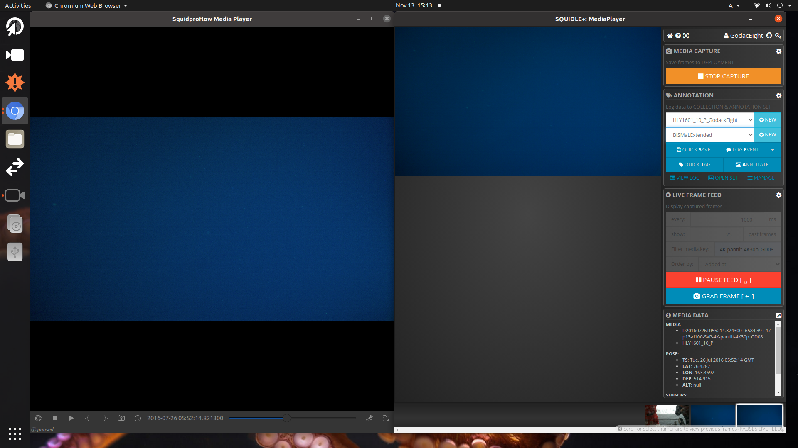
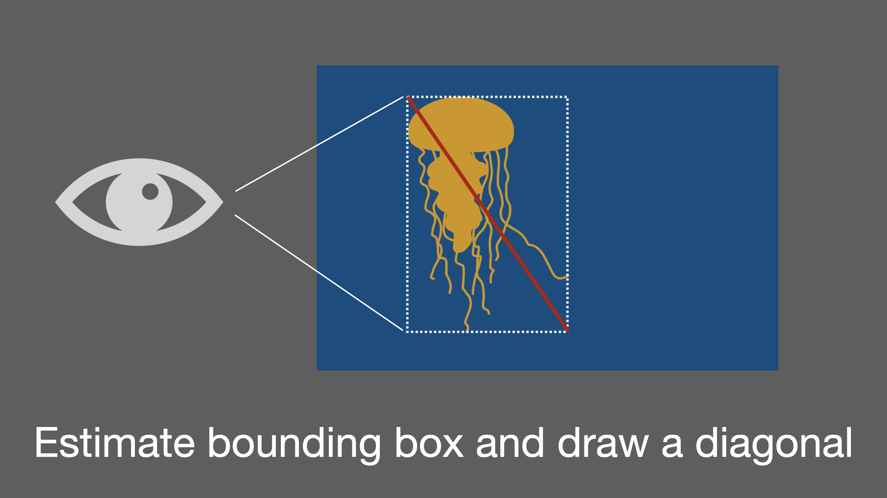

# アノテーション作業フロー

### 物体検出用ディープラーニングのための学習データセット作成
このミッションでは、ROVで撮影された北極性中層生物に対し矩形アノテーションを行います. 
タスクの概要は以下のとおりです. 

### タスク

- 生物種のある個体が出現した最初のフレームにタグをつけます. 
- 出現した１個体に対し可能な限り沢山のアノテーションをつけます. この時、前にアノテーションを行った画像と位置や角度などに変化があったことを確認します. 
- 同一個体に対して行ったアノテーションは全てリンクさせます.
- アノテーションを行った個体がフレームアウトする時の画像にタグをつます.
  
## 1. 最初のフレームを "Enter Frame" としてアノテーションする

1. 生物に遭遇するまでビデオを見続けます.
2. 生物を見つけたら,最初にすることはその個体が出現した最初のフレームに,"Enter Frame" とタグをつけることです。
    1. **SquidvidPro**上の**カメラのマーク** をクリックしてアノテーションしたい画像をキャプチャします.
    
    1. これにより,**Squidle+** にキャプチャ画像が送られます. **Squidle+**と**SquidvidPro**に同じ画像が表示されることで、これを確認できます.
    
    1. 今度は,**Squidle+** の画面のどこかをクリックします. これによりアノテーションができるようになります.
    1. キーボードの **A** ボタンを押すか, **ANNOTATE** ボタンを押すことでアノテーション画面をアクティベートします. 
    
    1. アノテーションウィンドウが見えました.
    1. カーソルでアノテーションしたい生物のいる場所を指し,ダブルクリックします. これによりアノテーションポイントが現れます.
    1. 検索フィールドに、付けたいラベルの動物分類群名をタイプします. ある程度の文字数を入れると,候補の分類群がポップアップします.
    2. 分類群名を選択すると,アノテーションポイントが分類群に固有の色に変わったことがわかります. そのポイントの上にカーソルを置くと、ラベルと一緒に選択した動物分類群名が表示されるようになります. 
    3. そのアノテーションポイントをもう一度ダブルクリックすると,アノテーション編集ウィンドウが表示されるようになります.
    4. **TAGS:** のフィールドをクリックし, プルダウンメニューから **Enter Frame** を選択します. 忘れずに **SAVE**で保存をしてください.
    ****5-10の手順について,以下のイメージインストラクションで確認できます.***
    
    
## 2. 　矩形アノテーションをする
出現した個体に対し, 前の画像と十分違いが見える場合, "Enter Frame" と "Exit Frame" 除いて**可能な限り沢山**の矩形アノテーションを行って下さい. **画像が多少ボヤけていても行います**. 矩形アノテーションには**二つの方法**があります.やりやすい方を適宜選んでください.

#### 方法1: カーソルをスライドさせる

1. アノテーションポイントをクリックしカーソルを移動させます.
2. 矩形の位置を調整したい場合は, アノテーションポイントをダブルクリックし, **Move**を選択し移動させます.

#### 方法2: 対角線を描く

1. アノテーションポイントをダブルクリックすると,アノテーション編集ウィンドウが表示されます. 
2. **Polygon** をクリックすると線を描けるようになります.
3. 描きたい矩形の対角線の始点を**クリック**し終点を**ダブルクリック**します.

1. 矩形の位置を調整したい場合は, アノテーションポイントをダブルクリックし, [方法1](#方法1-カーソルをスライドさせる)と同様に **Move**を選択し移動させます. 

***対角線で矩形を描く時のコツ**

#### 矩形の良い例と悪い例

## 3. アノテーションをリンクさせる
同一の個体に付与されたアノテーションは全てリンクされている必要があります.

1. アノテーションポイントをダブルクリックすると,アノテーション編集ウィンドウが表示されます.
2. **Link label** ラベルをクリックしリンクしたい画像を選択して下さい.

## 4. 最後のフレームを "Exit Frame" としてアノテーションする

1. 一つの個体に対する矩形アノテーションが全て終了したら,その個体が見えなくなる直前のフレームをキャプチャし,"Exit Frame"のタグを最後に付けます.
2. ほとんどの手順は [Enter Frame](#1-capture-a-first-image-as-enter-frame)と同様です. **Enter Frame**の代わりに**Exit Frame**を選択し, 忘れずに **SAVE**で保存してください.
