# アノテーションのためのソフトウェア環境セットアップ 

### Squidle+について
**Squidle+** を利用することで、**生物学的な画像記録データに対し様々なワークフローやモードでアノテーションすることが可能になります。**  
例）フレーム全体、ポイント、ポリゴン、バウンディングボックス、アノテーションごとにタグ付けやコメントなどを複数ラベル付与するこ

### Squidle+ と SquidvidPRO
北極データセットのアノーテーションには **Squidle+** と **SquidvidPRO** の両方を使用します。**Squidle+** は、画像へのアノテーションやタグ付けに特化したソフトウェアです。 **SquidvidPRO** はビデオキャプター機能を持ったビデオプレーヤーで、キャプチャー画像を **Squidle+** に送る機能なども備えています。

### アノーテーション環境をセットアップする

アノテーション環境のセットアップを始めましょう!

#### 1. Squidle+にログインする: 
   1. Squidle+ アイコンをクリックしアプリを起動します。   
   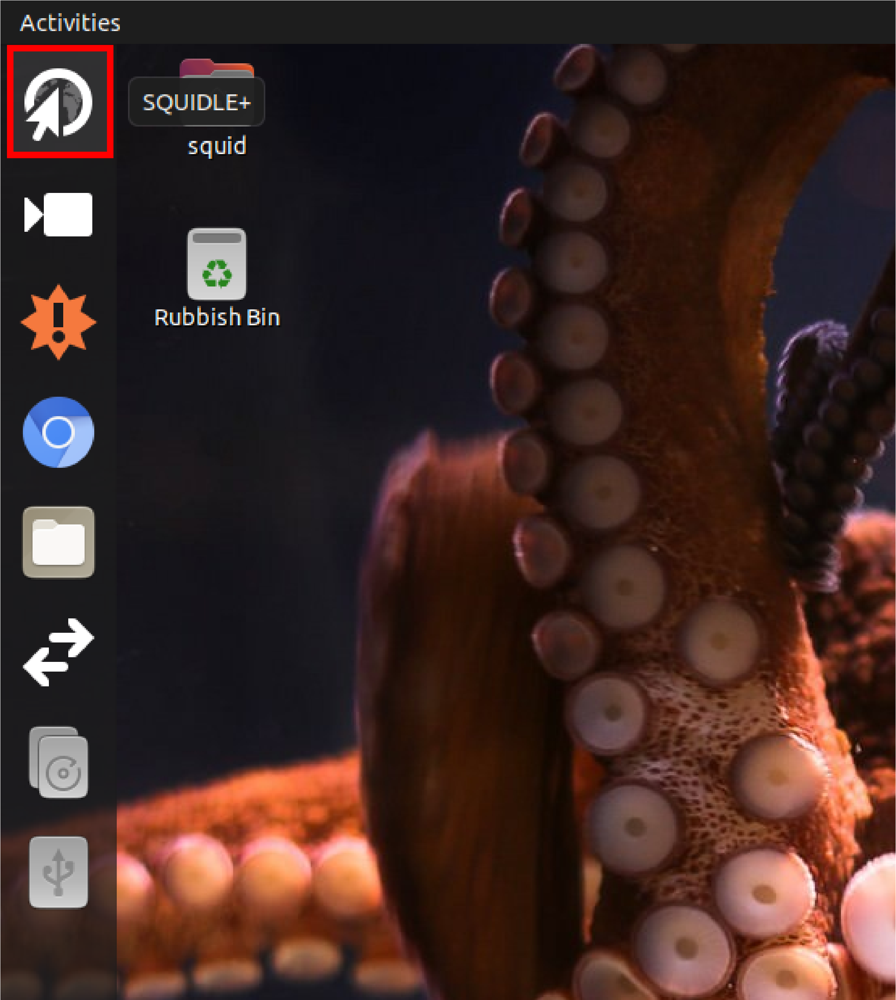

   1. **Log in >>** をクリックしてください   
   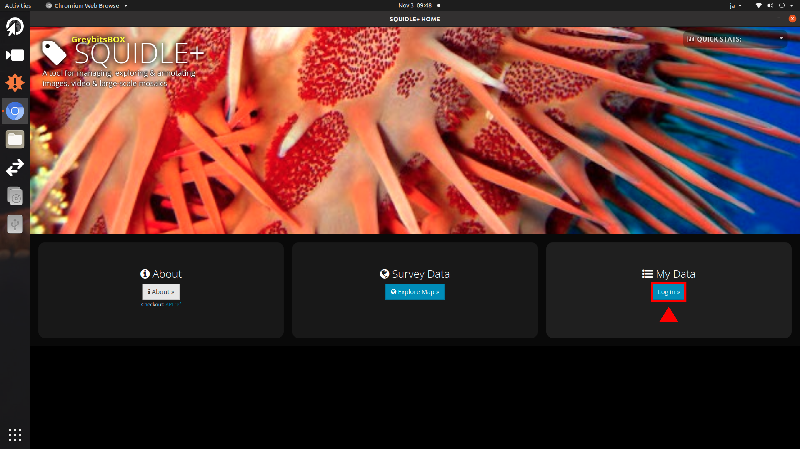

   1. **username** でログインする 
   あなたの username はすでに準備されてます。
   GODACの担当者に問い合わせるか、アノテーションチームの中で誰がどのusernameを使用するかを決めてください。  
   ***それぞれのアノテーターは個別のユーザーネームを使用してください。***
   ***例)***
   `Email or usename: GodacOne`
   `Password: godac` 
   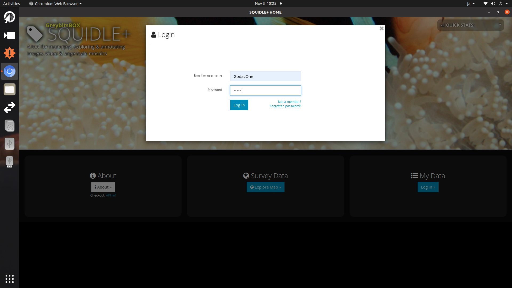

   1. **Frameplay GUI** を開く
   現在あなたはログインしています。次に **Frameplay GUI** を開きましょう。 
   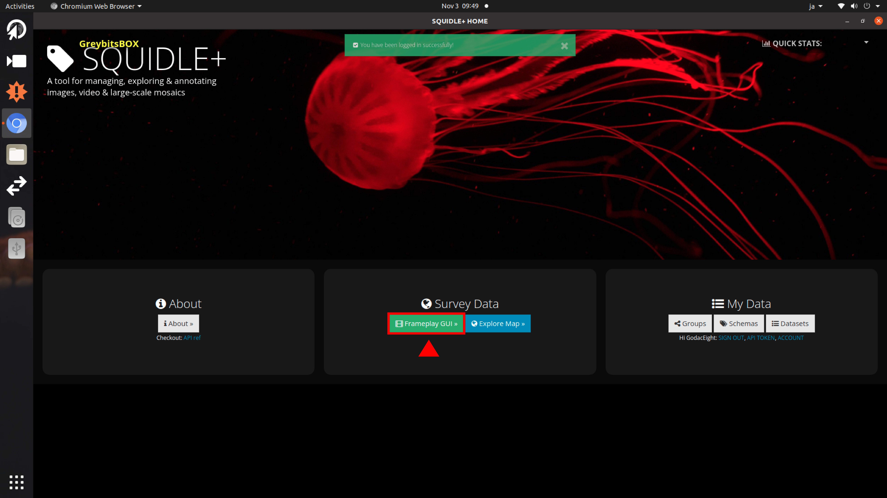
   下のようなウィンドウが見えていたら次へのステップへ進みます。 
   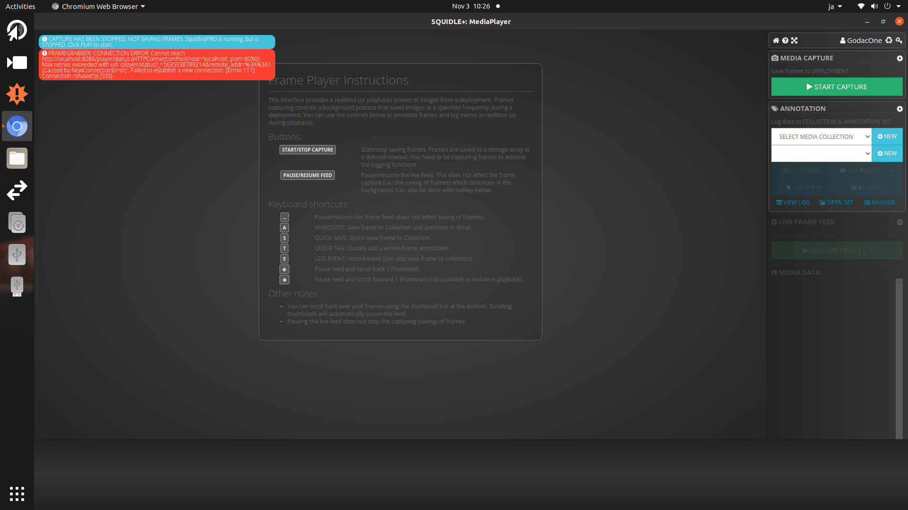
   
#### 2. SquidvidPRO を開く
   1. 下のように **Frameplay GUI** のウィンドウを小さくします 
   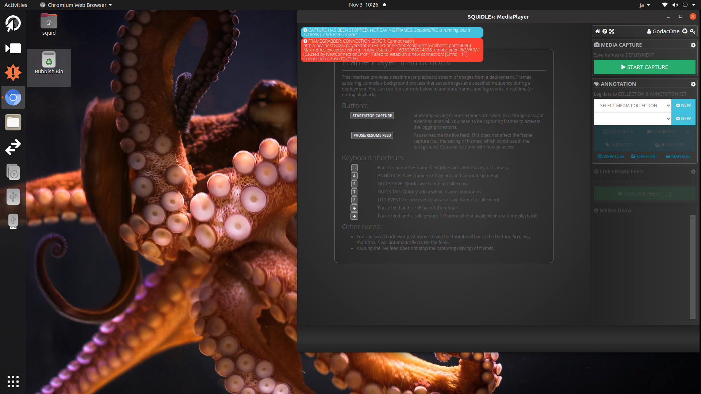

   1. **SquidvidPRO** を開きます 
   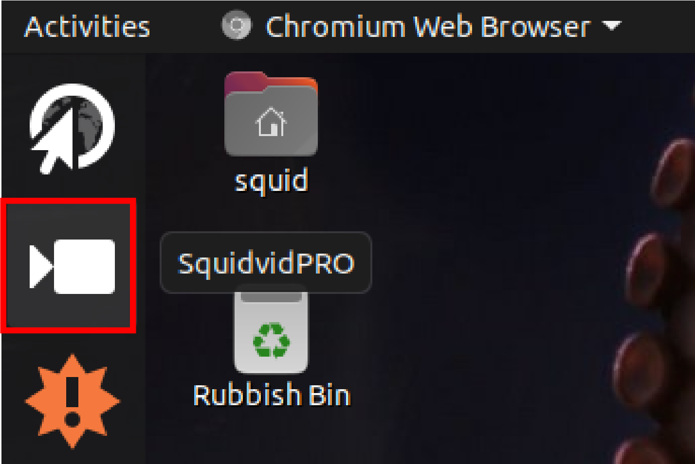
   **SquidvidPRO** と **Frameplay GUI** のウィンドウを以下のように並べます 
   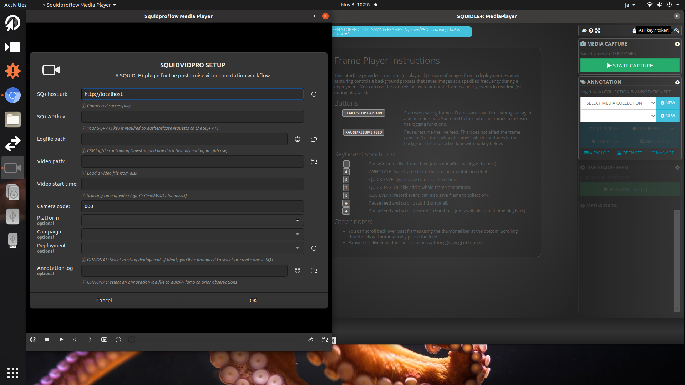

#### 3. API TOKEN を取得し SquidvidPRO をセットアップする
   1. **API TOKEN**を取得
   **Frameplay GUI** のウィンドウの、ユーザー名のすぐ隣にある**Key** アイコンをクリックします。 
   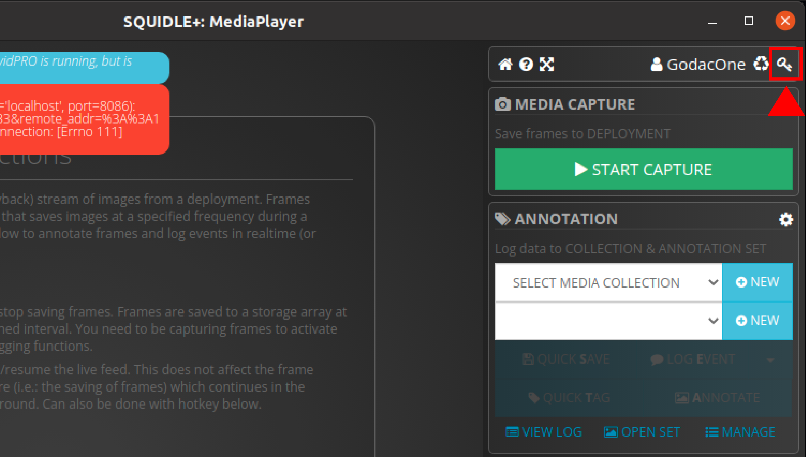

   1. **API TOKEN** をSquidvidPRO SETUP の **SQ+ API Key:** にコピーします。（選択項目のドラッグ＆ドロップでもコピーペースト可能です。）   
   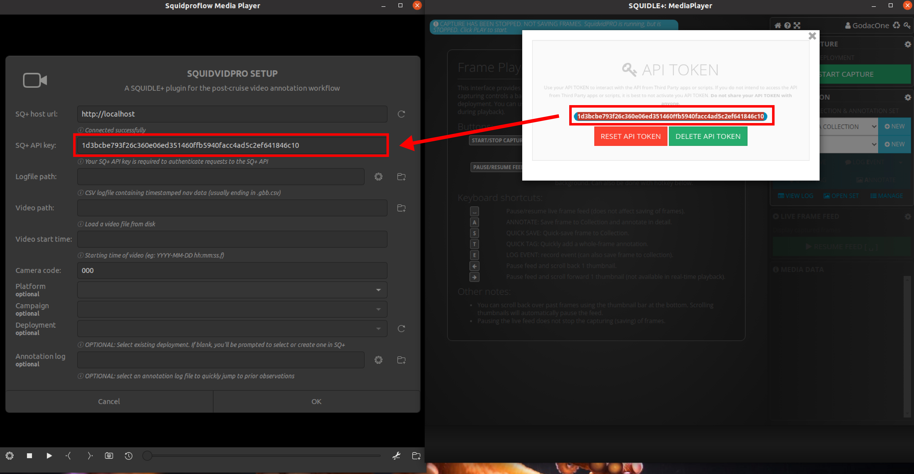
   
   1. ログファイルのロード
   ハードディスクから **Logfile path:** へログファイルをろロードします。
   今回のアノテーションでは、ログファイル名はすべて **HLY1601_full_NO_altitude.gbb.csv**　になります。 
   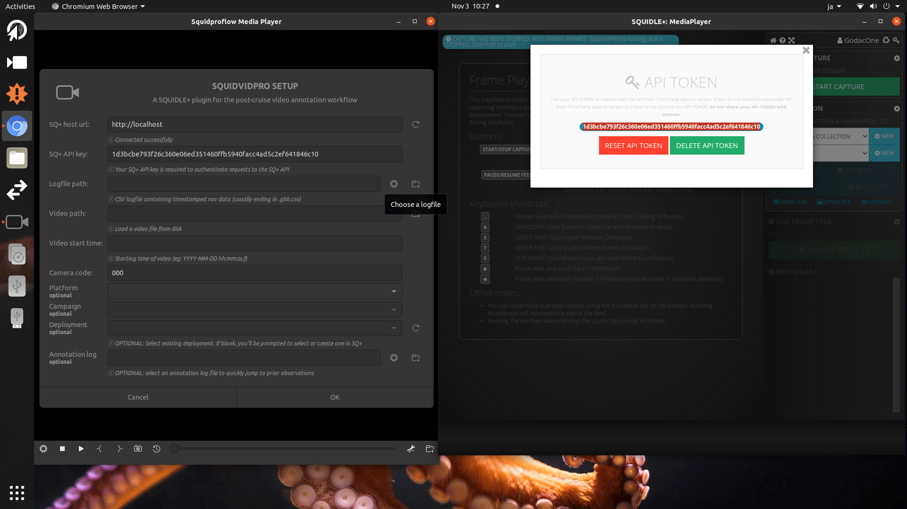
   
   1. ビデオファイルをロードする
   ハードディスクから **Video path:** へビデオファイルをロードします。 
   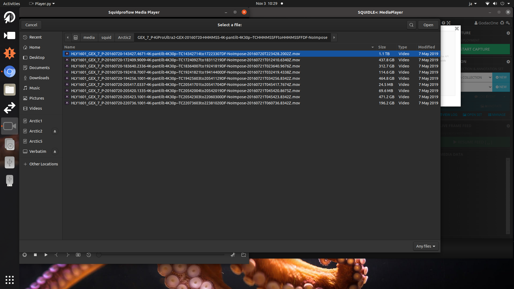

   1. **Video start time:** と **Camera code:** を **Video path:** から取得
      1. **Video start time:** は、ファイル名の末尾にある`.mov`の直前の項目を引用します。 それらは **`2016xxxTxxxxxx.xxxxZ`** のよう記述されています。**Zの直前までの** の文字列を **Video start time:** の項目にコピーペーストして下さい。（選択項目のドラッグ＆ドロップでもコピーペースト可能です。）
      1. **Camera code:** は、ファイル名の `camera_type-camera_angle-camera_resolution` (例： 4K-pantilt-4K30p) の項目を引用します。 これらを **Camera code:**　にコピーペーストして下さい。（選択項目のドラッグ＆ドロップでもコピーペースト可能です。） 
      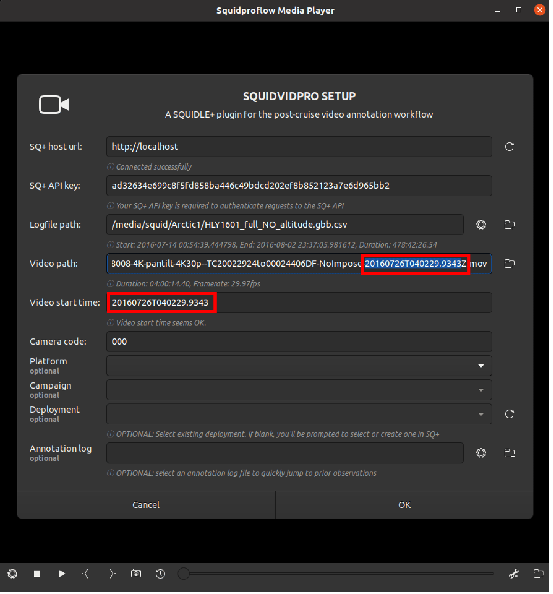

   1. Fill out **Platform** and **Campaign** from **Deployment**
      You can usually pick them by the pull-down menu.
      1. The **Platform** is always ought to be set as **GlobalExplorer** in this Arctic annotation task. 
      2. **Campaign** is also always ought to be set as **HLY1601**. 
      3. Only **Deployment** will be changed depending on which movie file you picked. Check the head of the file name.
      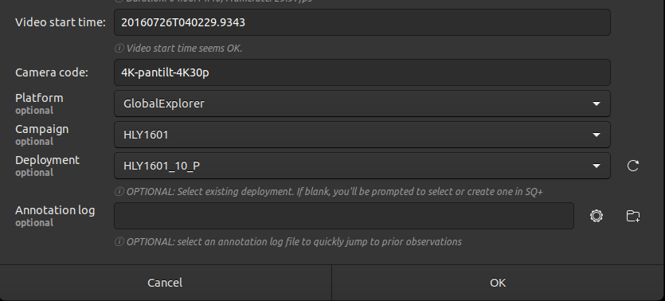  

   1. Now you are all set on SquidvidPRO and press **OK**
      Once you press **OK**, the **Deployment** will be loaded.
      Then you click **▶︎** mark of SquidvidPRO the video will be played. 
      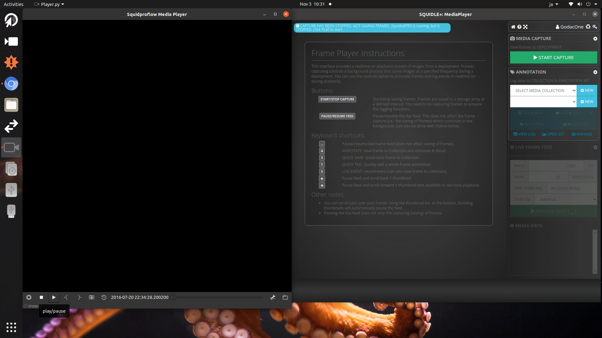
   
   1. **Media collection** and **Annotation set**
   Select the **Media collection** and **Annotation set** on Frameplay GUI.
   Now you are ready for Annotation!!
   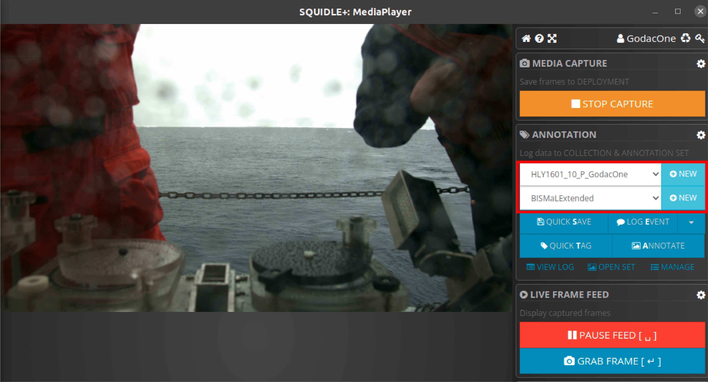
