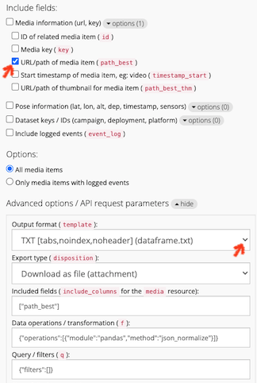
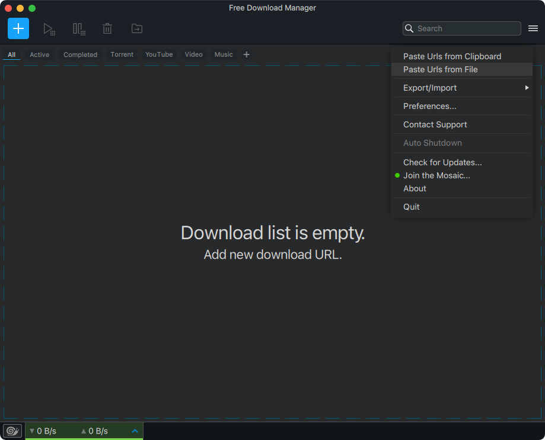

# How to download media objects
This system integrates several remote data repositories, the media object URLs don’t refer to links on this server. In 
order to download the media objects for a media_collection or deployment, you can 

1. Use the export tools to obtain a list of media URLs and then 
1. Download all the URLs in the list using one of many download methods 

****

## **OPTION 1**: Export media objects using GUI tools
The following example steps through how to download a list of media objects using the export user interface and then how 
to load the that url list into the [Free Download Manager](https://www.freedownloadmanager.org/) application to download 
the links.

#### Export the URL list

1. **Configure export fields:**
expand the Media information options by clicking on the “options” badge. Deselect all except for the media URL 
(i.e. `path_best`). NB: If you instead only want media thumbnails, select `path_best_thm` (instead of `path_best`).
   
    

    *Make sure that just one field is selected (as in screenshot above)*

1. **Configure export format:**
click the option to expand the advanced export options.
Select the `TXT` output format (dataframe.txt) to obtain a flat list of URLS with no header or index column

1. **Export the URL list:**
click the “Export” button to download the list and save it somewhere on your computer. Note the location.

#### Download the media from the saved URL list 

There are several different ways you can do this. The idea is to load your list of URLs into something and have it 
download them for you. This could be anything from a bash, python or R script to a GUI application. 
The example below outlines the use of a free, easy to use, open source GUI application.

1. **Download the Free Download Manager:**
[https://www.freedownloadmanager.org/](https://www.freedownloadmanager.org/) 

1. **Load URLs from saved file:**
once downloaded and installed, open it and select the “Paste Urls from File” option
This will add all the media objects from your downloaded file to a download queue.
   
    
   
1. **Download the media objects from the URL list:**
configure your desired output directory, and click the play button to start downloading!
   
This is an example using one GUI-based download tool. There are others.
****

## **OPTION 2**: Using the API and a bit of code
This is how you could use a script to export a list of media items for the `media_collection` with an `id` of `6485`.
We use the API to export the list and then save the images to disk:

### Python
```python
# get dependencies, note code below is python >=3.6
# pip install requests # to install request module if you don't have it
import requests, os, getpass

# configure some parameters
HOST = "https://squidle.org"    # the SQ+ host/instance you're pointing to
MEDIA_COLLECTION_ID = 6485      # ID of media_collection you want to export

# Get API token from user input for access permission (do not hardcode, save or share this)
API_TOKEN = getpass.getpass("Enter you API token: ") 

# API endpoint URL to extract data
url = f'{HOST}/api/media_collection/{MEDIA_COLLECTION_ID}/export?include_columns=["path_best"]'
data = requests.get(url, headers={'X-auth-token': API_TOKEN}).json()   

# create dir to save using name of media_collection
save_dir = os.path.join("media_collection", data.get("metadata",{}).get("name"))  
os.makedirs(save_dir) 

# iterate through, download & save images
for i in data.get("objects"):
    with open(os.path.join(save_dir, os.path.basename(i.get('path_best'))), 'wb') as handler:
        handler.write(requests.get(i.get('path_best')).content) 
```

For a more complex example python script that will export all (i) annotation_sets 
(ii) along with all associated media_collections
(iii) and in addition, download all media objects
that have been shared in a particular usergroup by the `group_id`, see [this example](../code_examples/export_annotations_and_media_by_usergroup.py)

###  R
```r
# TODO: Someone want to volunteer writing an R snippet? Jac?
```


Other scripting languages would be similar