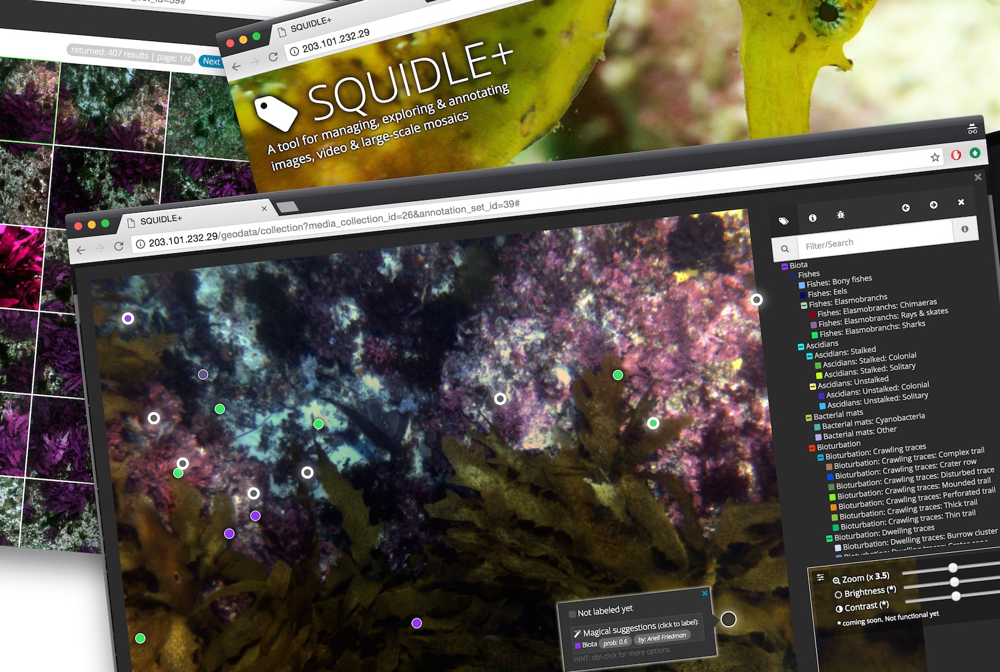

# About Squidle+
Squidle+ is an end-to-end marine image data delivery, management, discovery and annotation platform. It has been used by 
various international organisations as well Australian commercial environmental consultancies and it now forms the 
foundation of the National Understanding Marine Imagery (UMI) Facility, a new NCRIS-funded, sub facility of Australia’s 
Integrated Marine Observing System. UMI provides a centralised national repository for annotations and currently 
supports a variety of different data sources ranging from autonomous underwater vehicles (AUVs), remotely operated 
vehicles (ROVs), baited remote underwater video (BRUVS), towed underwater imagery and diver photo quadrat data from 
Underwater Visual Census (UVC, eg: Reef Life Survey).

The architecture makes the integration of additional data sources seamless through leveraging existing repositories of survey data hosted in a variety of cloud storage backends (Amazon Web Services S3, GoogleCloudStorage, Thredds, Apache, NFS, etc..). Once a data source has been defined, automated import services can be left to “set and forget” to watch an online repository and automatically import new data as it is uploaded.

It maintains links to originating survey data, and supports a variety of downstream analysis tools, including map-based exploration interfaces, summary & reporting tools, advanced image annotation tools and analytics integrations through the comprehensive API. This expedites data delivery and eliminates the need to offline-process and then manually manipulate / process / shift survey data around to conduct analyses on a third party platform.

It offers flexibility in annotation workflows and different annotation modes eg: whole-frame, points, polygons, bounding boxes, multiple labels per annotation with tags & comments and is designed to be media-type agnostic, eg: the same annotation framework can be used for images, videos, large scale mosaics, stereo images, transect quadrats, and more through the definition of media interpreter plugins. Integrated QA/QC tools, and cross validation between annotators enables both human-human and human-algorithm cross-checking and validation. 

Perhaps one of the most important problems that Squidle+ aims to solve is standardisation of the raw annotation data products. A major challenge when working with annotation data from disparate groups and projects is that there is little to no standardisation between the annotation schemes/vocabularies used for annotation and these can sometimes vary within groups from project to project. This poses a barrier to data reuse, syntheses between projects and large-scale training of ML algorithms. It is also not realistic to impose a single vocabulary upon scientists as their needs and projects are different. Enforcing a single standardised vocabulary is too restrictive for many scenarios, and tends to inadvertently drive users towards a splintered/bespoke approach to data analysis using other tools that provide the flexibility they want. Squidle+ aims to offer flexibility by supporting multiple annotation schemes (vocabularies) and analysis workflows that can be managed and standardised from within Squidle+ by crosswalking between schemes using semantic translation tools. This makes it possible to analyse data in a manner that suits users’ needs, and then export it in a translated target format of their choosing.

A comprehensive, feature-rich user group framework enables the sharing, collaboration and release of datasets allowing for granular granular permissions (with optional user agreements), permissions to modify and validate annotations collaboratively (with traceable authorship and attribution) and mechanisms for public release of data.

There is a substantial API underpinning Squidle+ facilitates interaction with the data using a user's API authentication token. In a similar way that data can be shared, collaborated on and validated between human users, algorithms can be set up as "users" of the system and can assist human users in their analysis on datasets that they have been granted access to through the same sharing framework. This architecture makes it possible to offer a variety of different externally (or internally) developed automated processing pipelines. It opens up the possibility of connecting independent machine learning (ML) researchers to real-world ML problems with validated training data, and conversely provides the marine science user community with access to algorithms that can help bootstrap their analyses. Other annotation tools that offer automation, are most often wedded to a particular internal ML pipeline. In this architecture each ML researcher or ML service provider can be in charge of administering their ML integrations. The comprehensive API and advanced export tools also facilitate integration with external services and databases (eg: ALA, OBIS, SeamapAustralia, AODN). 

### Background/Motivation
Currently only a tiny proportion of the images and video that are collected in marine surveys are analysed.
Transforming underwater imagery into quantitative information for science and policy decisions, requires substantial effort
by human experts. Different groups tend to handle the collected data in different ways, using different sampling
techniques, different annotation tools and even referring to the same taxa by different names. The lack of established
channels for data processing often results in significant lags between data collection and scientific discovery.
The decentralised, unstandardised nature of existing methods makes comparison across disparate sites difficult,
resulting little data re-use and limited collaboration. Having a global repository of data that has been annotated
in a consistent format opens up the possibility of answering ‘big picture’ questions and provides opportunities to
access large data sets for training machine learning algorithms. These algorithms ultimately have the potential to
provide a scalable, cost-effective and collaborative environment for dealing with huge volumes of seafloor imagery
and video through input from ecologists, biologists, experts, citizen scientists and machine learning algorithms.

###Development & Support
Squidle+ is currently being developed by Ariell Friedman
([Greybits Engineering](http://greybits.com.au/)),
with support from the [Schmidt Ocean Institute](http://schmidtocean.org/), the
[Integrated Marine Observing System](http://www.imos.org.au/) and the
[Nectar science cloud](https://nectar.org.au/new-australian-science-clouds/).

    
    
    
    

### Features

#### <i class="fa fa-database"></i> Flexible data storage
Requiring that all data is available/uploaded to the centralised web server poses a barrier for adding new data from other sources, duplicating data that is often already available elsewhere online.
Many national marine observing programs (for example IMOS through the Australian Ocean Data Network (AODN), or the Marine Geoscience Data System (MGDS) in the USA), are mandated to put data online in an openly accessible location.
These distributed data storage facilities should be leveraged to reduce data duplication and inconsistencies, and will also mean that data can be made readily available much more quickly.
Using the a framework for interpreting flexible meta data formats, it takes minutes (instead of days) to import datasets and get them ready for detailed annotation.

#### <i class="fa fa-tags"></i> Flexible annotation schemes
There is no one size fits all when it comes to annotation schemes.
Many have tried and failed to create an annotation scheme that suites the needs of all potential users, and now we have a variety of competing standardised schemes that exist.
Our approach is to provide a flexible annotation system which allows users to annotate data using their annotation scheme of choice (whether selected from existing standard schemes or a new custom one).
And instead of enforcing a single scheme, we will provide the capability to translate between different annotation schemes, which means that data labeled under one scheme can be viewed under another making sure that all annotated data is maintained in a consistent format.
In addition, it will allow multiple labels per point as well as apply additional tags and free-form comments per annotation.

#### <i class="fa fa-android"></i> Collaborative / automated labeling
Much of our scientific understanding of benthic environments ultimately depends on human interpretation of
seafloor imagery. Traditional approaches, largely reliant on manual annotation of a small subsets by human
experts, will not scale to the increasing demand for quantitative understanding of marine habitats for
science and regulatory compliance, nor to the increasing volume of seafloor images. This platform seeks to
enable and manage collaborative human-machine labelling invoking human
experts, citizen scientists and machine learning algorithms to achieve validated accuracy and predictable time
frames.

#### <i class="fa fa-film"></i> "Media object" annotation
The new system will enable the same consistent labels to be applied to different media objects (images, video and 
large-scale mosaics).
It will also offer the capability for defining validation sets based on other annotation sets for assessing annotation quality.
There is a widespread global need for a flexible web-based video annotation tool.
Using pre-existing video hosting technology, this is a relatively straightforward extension to the current platform.

#### <i class="fa fa-ship"></i> In-field data annotation
Unannotated data from the field can be considered to be a liability in the sense that it often results in huge 
repositories of images and video that need to be assessed at a later time. Real-time annotation for video and stills 
using the same annotation interface running a local caching database that can be easily synchronised with the online 
system post cruise, would make it possible to better leverage time and resources in the field and help to reduce the 
“post processing debt”.

#### <i class="fa fa-graduation-cap"></i> Education & outreach
With the advances in high bandwidth communications and social media, education & outreach activities have become 
commonplace on ocean-bound research cruises. It is possible to leverage the development effort in creating science 
tools to facilitate outreach goals, opening up the potential to acquire large volumes of crowd-sourced data that can 
compliment science objectives and engage the general public. We have already had some successes in this area.
