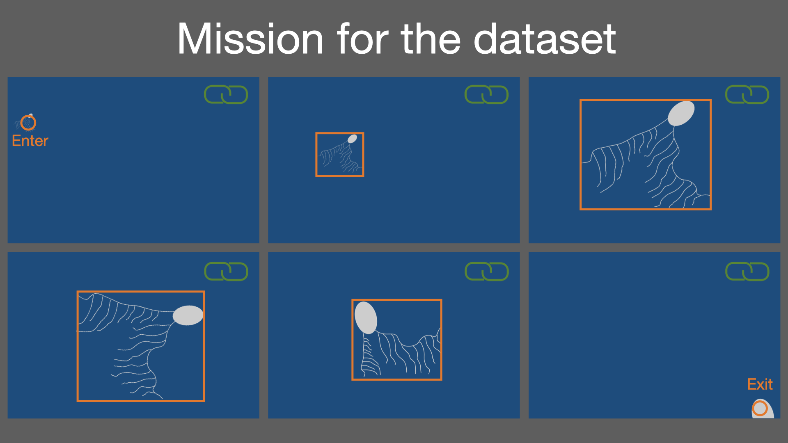

# Annotation mission for the Arctic dataset 

### Deep-learning training dataset for general object detection
In this mission, we will make bounding box annotation for the Arctic mid-water biota.
The abstract for the mission is depicted as below. 

### Tasks

- Give a tag for the first frame the individual appeared 
- Giving bounding boxes as much as possible for the individual but make sure there is the differences from the frame previously captured 
- Link all images tagged on the same individual
- Give a tag for the last frame the individual appears
