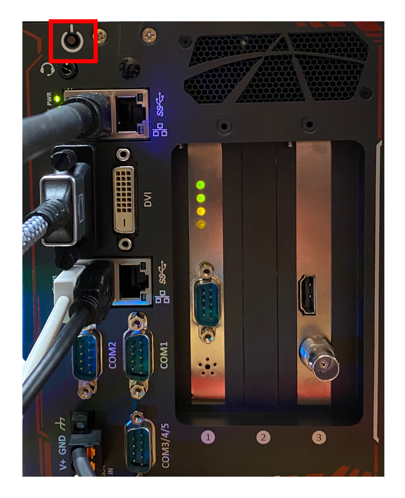
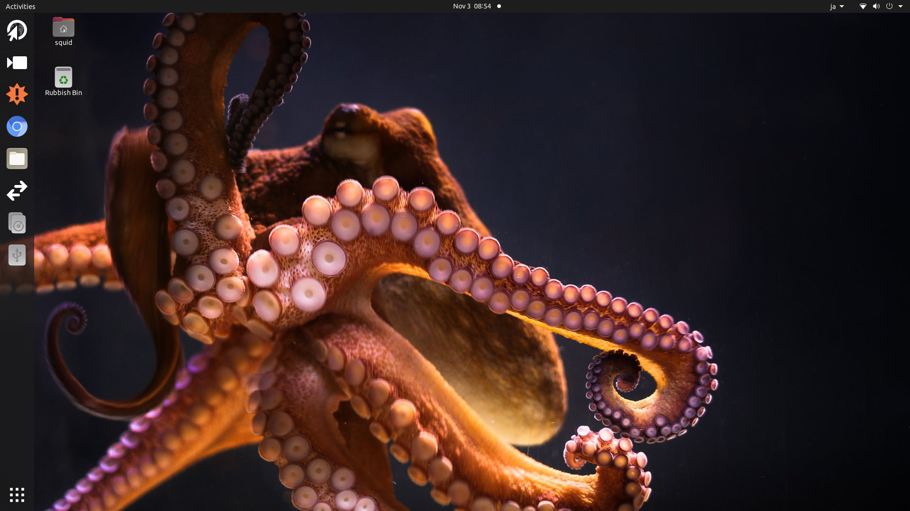

# Set up the physical environment for the Arctic dataset annotation 

### About this dataset
This is an Arctic ROV research dataset that is collected using ROV *Global Explorer* during a RV/*HEALY* cruise No.1601.

Chief Scientists: Russ Hopcroft , Katrin Iken.
JAMSTEC representative for the cruise: **Dhugal J Lindsay  (dhugal@jamstec.go.jp:9563)**
JAMSTEC representative for the Annotation: **Mitsuko Hidaka (mitsukou@jamstec.go.jp:5852)**

### Physical environment setup for the annotation

All the annotation should have been done using an annotation software **Squidle+** has already been installed in the field annotation server GreyBitsBox(GBB). 

The devices and items that all you need are as the image below.

Now you are using **GreyBitsBOX version 5 (GBB5)** which is depicted as the legend number ①. All the other devices and items ② to ⑥ need to be physically connected to ①.

1. **Boot GBB5**: 
  If you connected everything to GBB5, now you are all set to turn on GBB5. **Push the power botton until you hear a beep sound.**
  

1. **Home screen**: 
   If you are seeing the home screen of GBB5 as below, you successfully booted the system.
   So, let's move on to [アノテーションのためのソフトウェア環境セットアップ](../annotation/setup_annotation_software_environment_en.md)を始めましょう。
  

