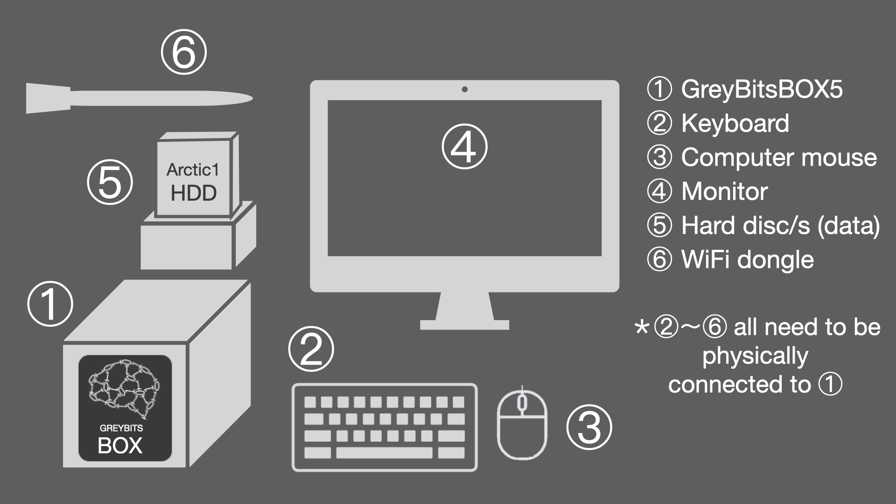
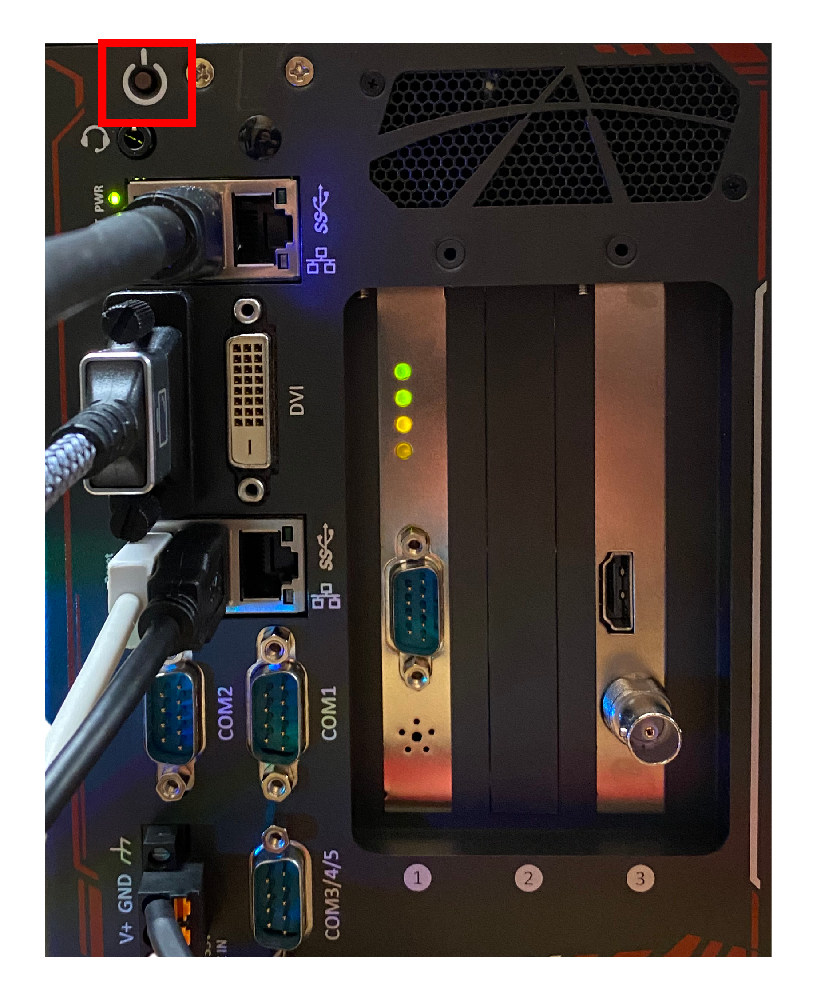
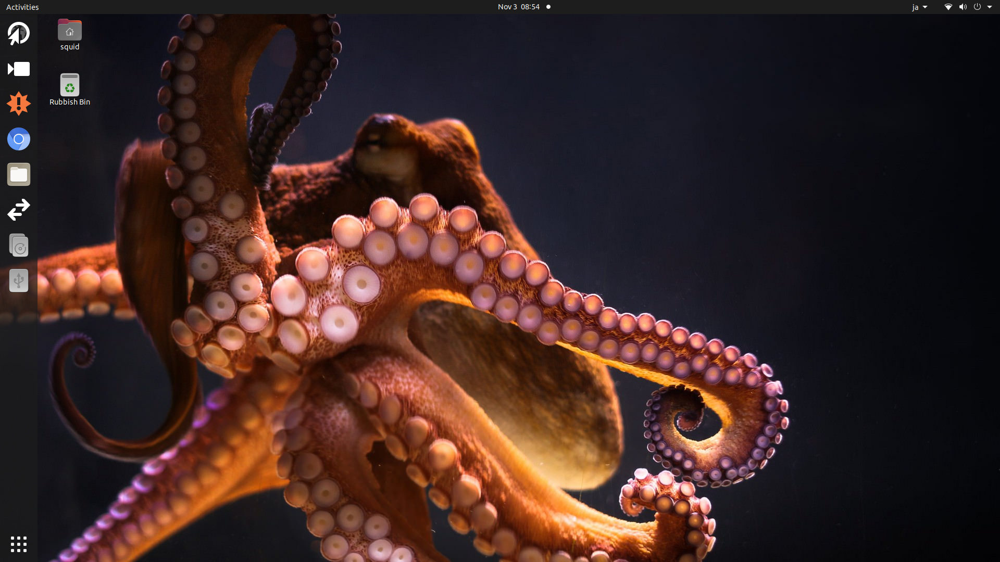

# 北極データセットアノテーションのための物理環境セットアップ 

### 北極データセットについて
このデータセットは、米国の研究船*HEALY*の1601航海でROV/*Global Explorer*によって取得されたデータセットです。

研究主任: Russ Hopcroft , Katrin Iken.
本研究航海のJAMSTEC代表 : **Dhugal J Lindsay  (dhugal@jamstec.go.jp:9563)**
JAMSTECにおける本データセットアノテーションの責任者 : **日高弥子 (mitsukou@jamstec.go.jp:5852)**

### アノテーションのための物理環境セットアップ

全てのアノテーションは、フィールドサーバアノテーションシステム**GreyBitsBox(GBB)** にインストールされた **Squidle+** を使用して行って下さい。

作業に必要な装置や接続機器は以下の通りです。

現在、皆さんが使用しているシステムは図中の①**GreyBitsBOX version 5 (GBB5)** です。②から⑥の接続機器類はすべて、物理的に①に接続されている必要があります。

1. **GBB5を起動する**: 
  全ての機器が接続されていることを確認したらGBB5の電源投入をして下さい。**起動音がするまで、パワーボタンを押して下さい。*
  

1. **ホームスクリーンの確認**: 
  しばらくして、以下のようなスクリーン画面が確認できたら、起動成功です。
  [アノテーションのためのソフトウェア環境セットアップ](../annotation/setup_annotation_software_environment_jp.md)を始めましょう。
  

