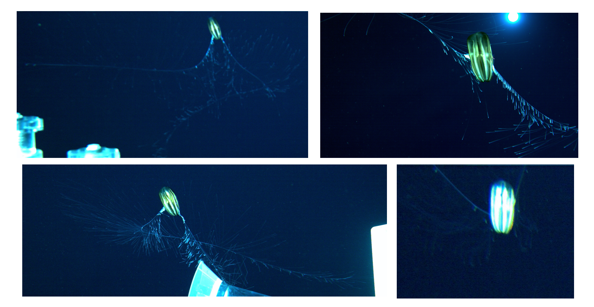
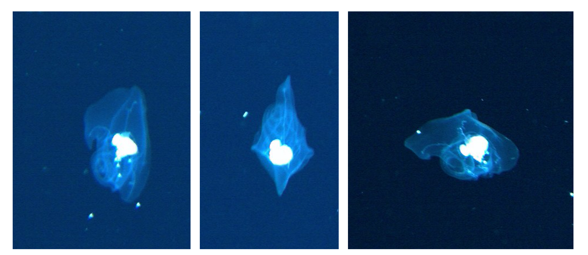

# 北極データセットにおける主な出現生物種
このドキュメントに,北極の中層のROV映像によく出現すると考えられる32分類群についてリストアップしました. アノテーションの際にはこちらの資料を参照してください.

**さらに多くの画像を参照したい場合は [こちら](http://localhost/geodata/annotation_set/85#qac) でアクセスできます。** このリンクは、GBB5のローカルリンクのみ対応しています。 

# Ctenophora (Phylum)
## Lobata (Order)

### *Bolinopsis infundibulum* 

## Beroida (Order)
### *Beroe cucumis* 

## Cydippida (Order)
### *Nudaulacoctena arctica* 

### *Ctenoceros* ‘white’ 

### Cydippida (Smoky Vamp) 

### *Mertensia ovum* 

### *Cydippida* (river lips) 

### *Euplokamis*  

### *Dryodra glandiformis*  

# Cnidaria (Phylum)
## Siphonophorae (Order)

### *Marrus orthocanna*  

### *Rudjakovia plicata*  

### *Dimophyes arctica*  

### Clausophyidae  

### *Nectadamas*  

## Hydrozoa (Class)

### *Sminthea arctica*  

### *Botrynema brucei*  

### *Botrynema ellinorae*  

### *Crossota norvegica*  

### *Crossota millsae*  

### *Benthocodon hyalinus*  

### *Solmundella bitentaculata*  

### *Bathykorus bouilloni*  

### *Ptychogena*  

### *Aeginopsis laurentii*  

## Scyphozoa (Class)

### *Atolla* (*Atolla tenella*)  

### *Chrysaora melanaster*  

# Mollusca (Phylum)
## Octopoda (Order)

### Cirroteuthidae  

## Pteropoda (Order)
### *Clione*  

# Arthropoda (Phylum)
## Crustacea (Subphylum)
## Mysida (Order)

### *Boreomysis arctica*  

## Amphipoda (Order)

### *Themisto*  

# Chordata (Phylum)
## Tunicata (Subphylum)
## Appendicularia (Class)

### Appendicularia  

## Vertebrate (Subphylum)
## Gadiformes (Order)

### Gadiformes  

