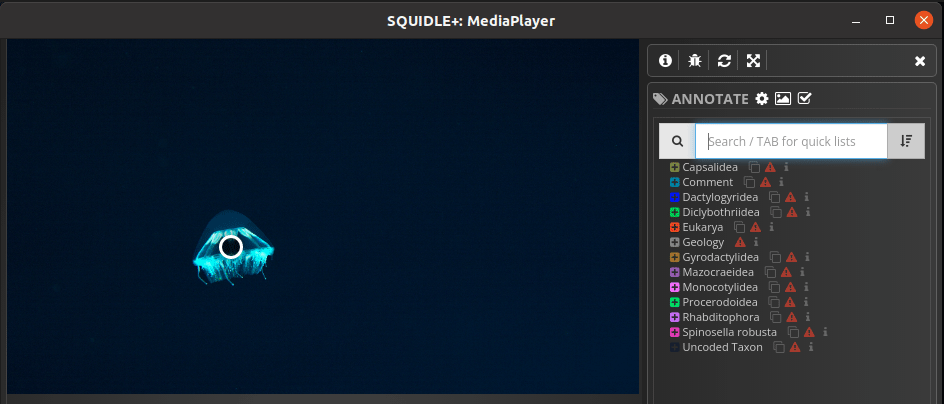
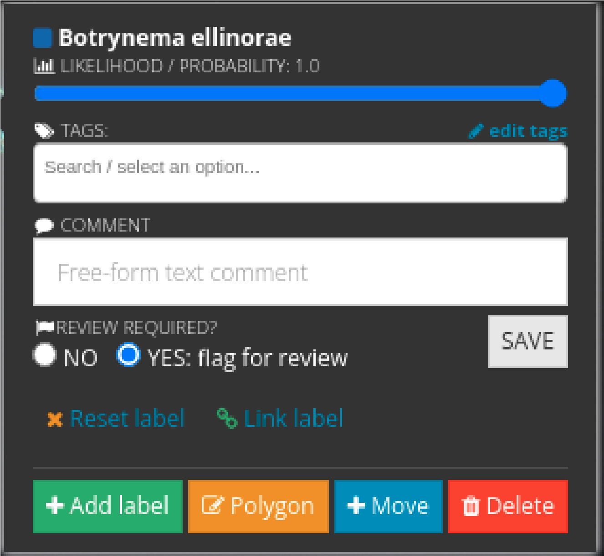
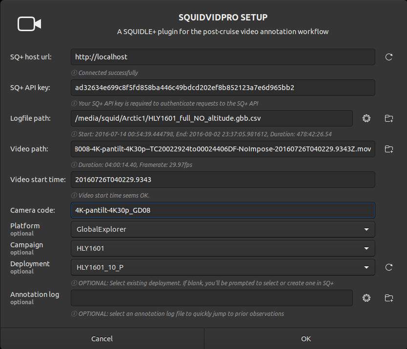
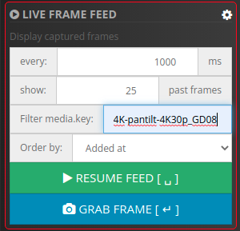

# Tips for using squidle+

### Pulldown selection for the taxon that you already annotated once

**If you will annotate a taxon you already annotated once**, the taxon can select using **pulldown**. By clicking the sorting button which is placed just next to the taxon search field.

### If you have no confidence for the taxon ID

If you have no confidence in the taxon ID, activate **YES:flag for review**

### Showing only the annotation that was annotated by you

1. Go **SQUIDBIDPRO SETUP** and give unique ID just after Camera code 
Example:
If you are GodacEight, add `_GD08` just after `4K-pantilt-4K30p`.
 
1. Go **Squidle+** window, then click **gear mark** on **LIVE FRAME FEED**.
1. Copy-paste the unique Camera code which was made on **1.** to **Filter media key:**. 

