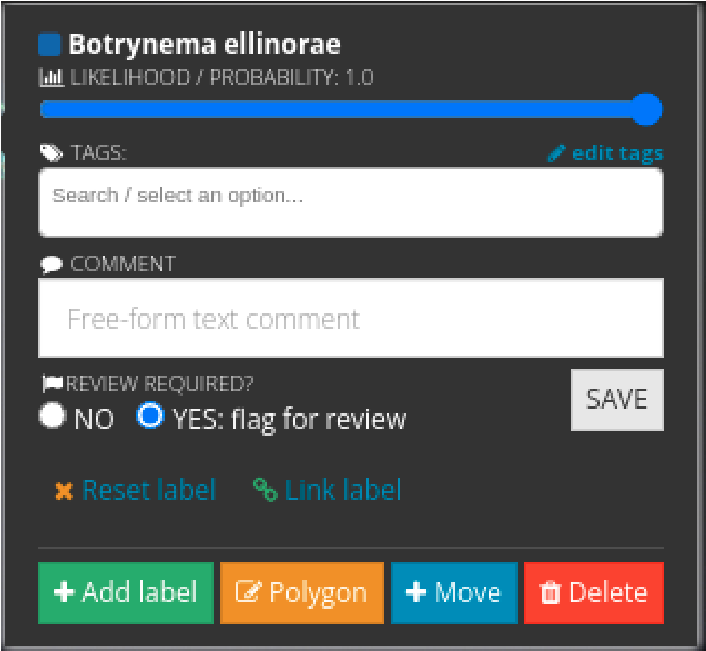
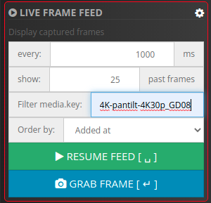

# Squidle+アノテーションのあれこれ

### 一度アノテーションした分類群はプルダウンで選択可能

**一度アノテーションした分類群** は, 分類郡検索フィールドのすぐ横にあるソートボタンでプルダウン選択ができるようになります.

### 分類群の同定に自信がない場合

もしアノテーションに付与した分類群名に不安がある場合は **YES:flag for review** をアクティベートしてください. 後で専門家がチェックできます.

### 自分がキャプチャした画像やアノテーションだけを表示する

1. **SQUIDBIDPRO SETUP** に行き, カメラコードにユニークなIDを付けます 
例:
もしあなたが GodacEight の場合, `_GD08` を `4K-pantilt-4K30p` のすぐ後ろに加えます.

1. **Squidle+** のウィンドウに移動し**LIVE FRAME FEED**にある**歯車マーク**をクリックします.
2. **1.** で作成したユニークな Camera codeを **Filter media key:** にコピーペーストします. 

